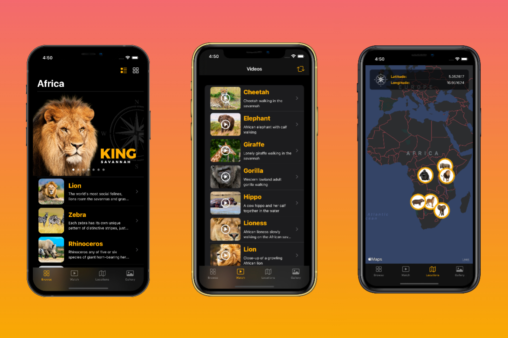

# Africa-App
Africa-App made developed SwiftUI with Multiplatform integration. Africa-App is build for practising on working with UI elements and animations in SwiftUI.
## Technologies that were used while developing the project:
- MapKit
- AVkit
- Combine
- Codable
- PropertyWrappers
- Stickers Extension 

